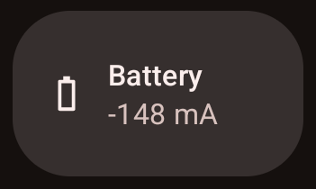
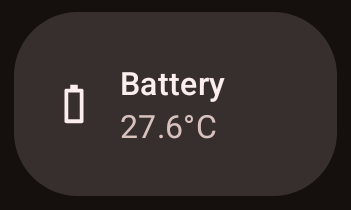
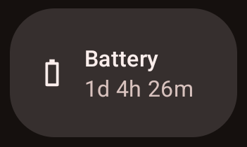
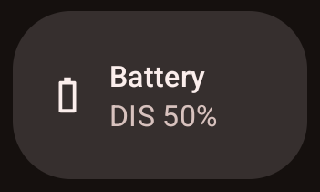

<h1 align="center">Battery Tile</h1>

**Android battery QS tile (current, temperature, time, status).**

- Works on Android 12+.
- Toggle between current, temperature, time, and status.

[**`Download`**](https://github.com/pgaskin/batterytile/releases/latest)

<table><tbody><tr>
<td></td>
<td></td>
<td></td>
<td></td>
</tr></tbody></table>
